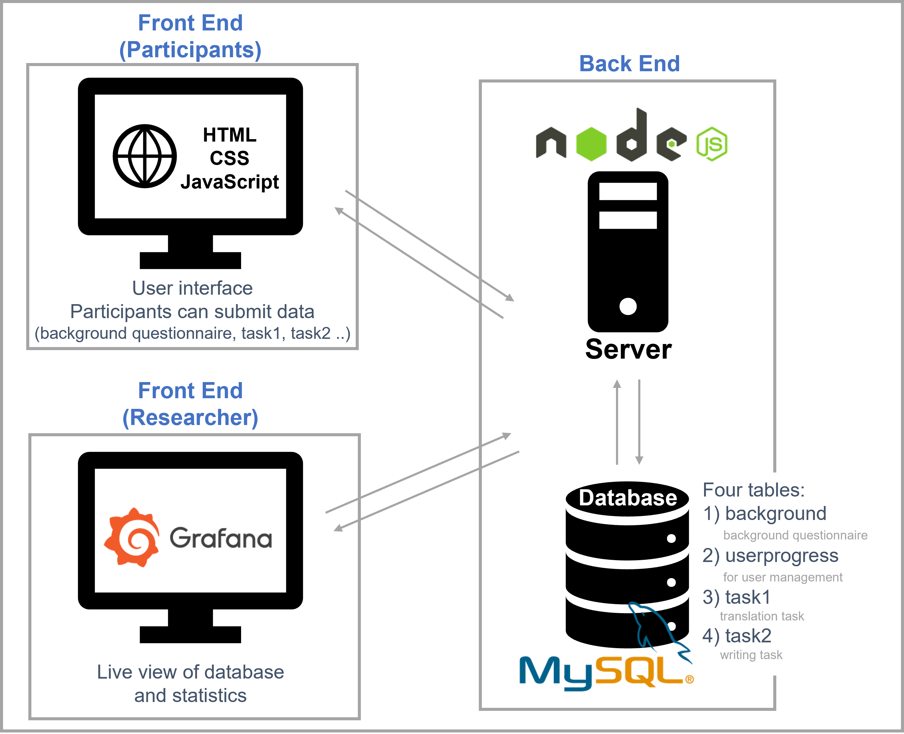

# Data collection project for error analysis of Korean language learner

## Description
This repository contains source code for the web-based data collection project to gather writing data of beginner Korean learners.

### Purpose of the project
The number of people who learn the Korean language is increasing annually. To teach Korean more effectively, the types of errors made by learners need to be analyzed and reflected in the teaching. This information can be fed for example into learning apps, which will enable more interactive learning. For this purpose, this project gathers two kinds of writing data of beginner Korean learners which will be used for error analysis.

### Which data is collected?
1) Basic information about the participants (background questionnaire)
    - Name, email, age, birth date, nationality, major/native language, information about Korean learning, language certificate
    - This information is needed to analyze writing data properly. Especially, it is expected that learners with different levels of Korean and native language show different kinds of errors.

2) Writings in Korean 1 (task1 - translation task)
    - 40 short sentences translated from English to Korean

3) Writings in Korean 2 (task2 - writing task)
    - Five short writings with specific topics (100-120 characters for each topic)
   
  All the question sentences are extracted from level 1~2 Korean text books published by King Sejong Institute, a public institution under the Korean Ministry of Culture, Sports and Tourism, and modified slightly to fit the purpose of the project.


### How does the system work?



  
## Requirements
1. [Node.js](https://nodejs.org/en/)  
2. [mySQL, server ver ==5.6](https://dev.mysql.com/downloads/mysql/)
3. [Grafana](https://grafana.com/grafana/download?pg=get&plcmt=selfmanaged-box1-cta1)


## Install and Setup

1. Clone this repository
  
2. Install extra nodejs packages in the repository folder using npm

    2-1) mysql
          ```
          npm install mysql
          ```

   2-2) alert
          ```
          npm install alert
          ```

  
3. Setup mySQL server  
! Please change the configuration in the variable `con` in `database-setup.js` and `start-server.js` to use other user name and password.
Example code below with localhost, database name `kor`, username `korlearn` and password `korlearnpw` (default set in scripts):   
   
    3-1)   
    Create user and database in mysql command line client  


    ```
    create user 'korlearn'@'localhost' IDENTIFIED by 'korlearnpw';
    ```

    Grant privileges
    ```
    grant all privileges on *.* to 'korlearn'@'localhost';
    ```

    Create database
    ```
    create database kor default character set utf8 collate utf8_general_ci ;
    ```


    3-2) create tables in database
      `
      node database-setup.js
      `

4. Setup Grafana  
      4-1) Go to the grafana server (default: localhost:3000) and login  
      (default id: admin, password: admin)

      4-2) Add MySQL database
      - Go to `Configuration-Data sources`
      - Click `Add data source`
      - Choose `MySQL`
      - Put host, database, user, password information and click `Save&test`   
        Example with default setting:   
            ```
            host:localhost,   
            database:kor,   
            user:korlearn,   
            password:korlearnpw
            ```

      4-3) Add dashboard
      - In the main page, go to `creat-import`
      - Click `Upload JSON file`
      - Select `grafana-setup.json` in the repository root
      - Click `import`


## Usage

1. Run the server
      ```bash
      node start-server.js
      ```
    Clients(participants) can now access the server and submit data.  
    Default server address is `localhost:3300`


2. Check database in Grafana  

    Go to the grafana server (default: `localhost:3000`) and login  
    You can see the (in the step `4-3`) uploaded dashboard in `Dashboards-Manage` (Dafault dashboard name: `Data Collection - Error Analysis`)  
    This information is provided live in the dashboard:
    - Raw view of all tables
    - Progress: the total number of participants, participants' progress ratios
    - Statistics about participants' background: distributions of the native languages, Korean and English level  
    If you want, you can add more statistics by creating new panels.  
 
    The dashboard will be refreshed automatically (default: every 30 minutes)


## License
[MIT](https://choosealicense.com/licenses/mit/)
